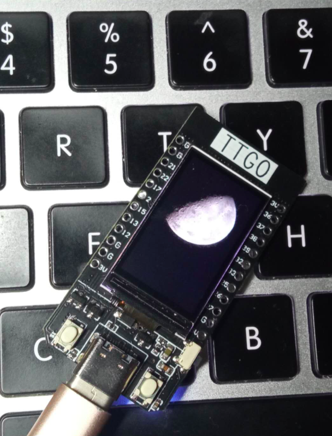

# ttgo-image-upload

esp32+tft(135*240)

## info

base on [https://github.com/nori-dev-akg/esp32-ST7789-Upload](https://github.com/nori-dev-akg/esp32-ST7789-Upload) and change Arduino_ST7789.h to TFT_eSPI.

代码源自 [https://github.com/nori-dev-akg/esp32-ST7789-Upload](https://github.com/nori-dev-akg/esp32-ST7789-Upload) 并用TFT_eSPI库替代了原有的Arduino_ST7789。

使得ttgo可以使用。

## tft pinout

|  功能   | 针脚  |
|  :----:  | :----:  |
| MOSI  | 19 |
| SCLK  | 18 |
| CS  | 5 |
| DC  | 16 |
| RST  | 23 |
| BL  | 4 |

## demo

## miniprogram

小程序端：[https://developers.weixin.qq.com/s/V7nVqSm27LkY](https://developers.weixin.qq.com/s/V7nVqSm27LkY)
